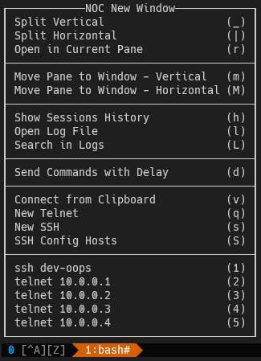

# tmuxNOC <!-- omit in toc -->

tmux config and scripts for people, who have to manage a lot of network devices.

- [Why?](#why)
- [What it does](#what-it-does)
- [Installation](#installation)
- [How it works](#how-it-works)

## Why?

I started this project, because everyday I manage a lot of devices, to which I need to connect with telnet or SSH. For the long time I used SecureCRT for this, because it a good solution for this type of purposes. I also like tmux, and wondered if I could bring functionality that I like in SecureCRT to tmux.

For every day use I used [samoshkin](https://github.com/samoshkin)/**[tmux-config](https://github.com/samoshkin/tmux-config)**, it showed me that tmux can be very different from it's default look and settings. Some parts of my config is taken from there, color scheme and overall look is practically a direct copy. Then I dived into [man pages for tmux](https://man.openbsd.org/OpenBSD-current/man1/tmux.1)  and it showed me that you can do practically anything with it.

## What it does

Basically main part of this project is python script. It used to show tmux menus, opening connections for telnet or SSH, writing connections history, writing connected device terminal output in form of logs, automated sending of login/password to the device, sending commands to the device with delay, etc.

After entering `Alt + q` you will see this menu:

- The first section of the menu is for choosing where to open new telnet or SSH session, or any other option from this menu. Like opening log file or viewing session history.
    - Take a note of menu title, it tells where selected option will be opened.
    - By default it will be opened in new tmux window.

- Next section is for moving current tmux pane to other tmux window.

- Section after that is for opening session history file or log file or searching in log files.

- *"Send Commands with Delay"* is script for sending multiple lines to the connected device with line delay or/and character delay. It can be used only from *"NOC New Window"* menu.

- Next section is for opening connection to the device. *"Connect from Clipboard"* is for opening connection to hostname or IP stored in clipboard. *"SSH Config Hosts"* will open new menu that will let you chose from hosts stored in your `.ssh/config` file.

- Next section lists five last hosts that you connected to, so you can reconnect to them quickly.

## Installation 

Just clone the repo into your home directory, because scripts rely on that this project resides in `~/tmuxNOC`. Then run `install.sh`. It will replace your `.tmux.conf`, so make a copy it you need it.

This config and scripts need:
- tmux 3.1b
- expect
- Python >=3.6

Tmux, expect and other dependencies will be installed by the install script, **but not Python**. It was tested in Debian like distributions and in WSL (Ubuntu 18.04) in Windows 10 with Windows Terminal. Only works with `apt` package manager.

## How it works

This is work in progress project, especially documentation. Later I will add explanation how everything works. For now, in the code itself I tried to make comments and descriptions, some explanation about how everything works you can find there.

Information about key bindings you can find in [KEYS.md](https://github.com/Technik-J/tmuxNOC/blob/master/KEYS.md), but it also yet not finished.
